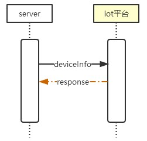
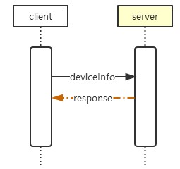
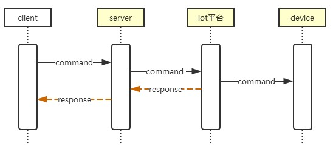
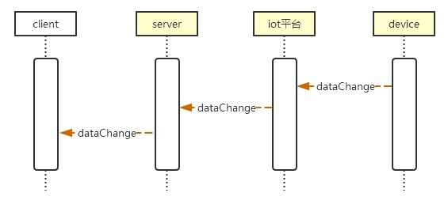

# 1.开发环境准备 #


 1.1 安装  [nodejs](http://nodejs.cn/download/)  

 1.2 安装  [jdk](http://www.oracle.com/technetwork/java/javase/downloads/index.html "jdk")，并配置Java环境变量  

 1.3 下载  [android sdk](http://www.android-studio.org/index.php/download "android sdk")，配置 [ANDROID_HOME环境变量](https://www.cnblogs.com/harlem/p/6794616.html)  

 1.4 通过以下命令安装cordova


```
npm install -g cordova
```

# 2.server #


 服务器：centos7

2.1 安装nginx，安装可部分参考[CentOS下配置python3+flask的web服务环境](https://blog.csdn.net/u012212157/article/details/78227584)，将 server/nginx 目录下文件复制到 nginx.conf 同级目录下，覆盖nginx.conf 文件 

2.2 安装node，安装可参考[如何在 CentOS 安装 node.js](https://blog.csdn.net/lu_embedded/article/details/79138650) 

2.3 进入 /opt 目录下，将 server/node 文件夹复制到/opt目录下，进入 /opt/node 目录下执行以下命令即可启动服务

```
npm install  
node app.js
```

**注意：**
- 需要配置https
- 请将nginx.conf中的证书路径替换成自己的
- 请将 /opt/node/app.js 中iot平台的IP、端口号以及appID,密钥替换为自己的。


# 3.client #

3.1 进入client项目下执行以下命令
```
npm install
```

通过以下命令运行及构建

```
cordova run browser  //在浏览器运行

cordova run android  //在安卓运行，需手机连接（打开usb模式，或模拟器） 

cordova build  --release  //构建 
```
其他命令参考[Cordova中文网](http://cordova.axuer.com/#getstarted)

**注意：**
- 请将device.js中的接口地址指向自己的地址

# 4.系统序列图 #
4.1 服务端启动  

服务端启动时，向iot平台获取设备信息保存，并定时更新



4.2 客户端启动  

客户端启动时，向服务端获取设备信息  



4.3 数据变化

设备数据变化时，逐层推送到客户端



4.4 指令下发

控制指令通过服务端中转，由iot平台下发到设备




 
  


